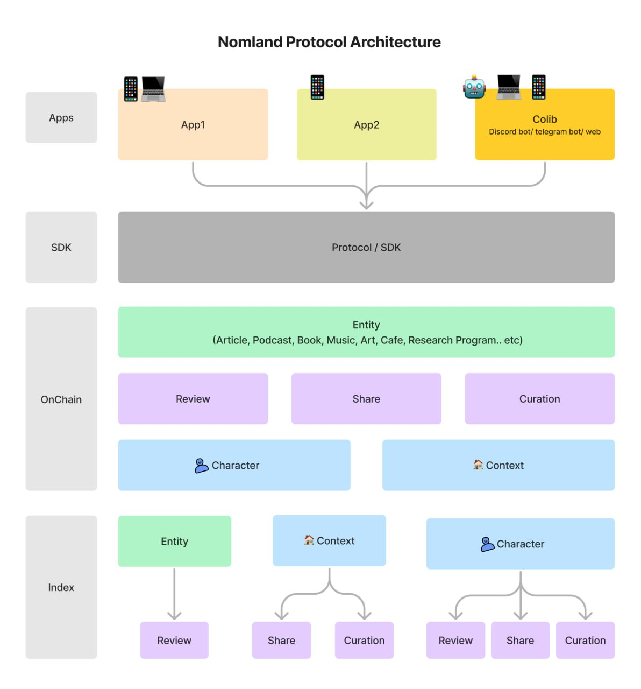

# 简介

## 什么是 Nomland Protocol？

Nomland 是一套关于评论、分享与策展的协议，规范并聚合了多样的内容，并对评论、分享、策展整个周期中涉及的价值进行记录。

## 为什么需要 Nomland？

对于还没有被统一或记录的分享场景，Nomland 可以在统一这些场景并在其上建立全新的应用（[社区图书馆](https://colib.app)就是第一个这样的应用）；对于已经被记录的分享（如大众点评/yelp/豆瓣）场景，Nomland 将为其提供价值分配的引擎帮助其变得更好。

## 总览

Nomland 规范了日常生活中评论或分享场景。对于一次典型的评论或分享，Nomland 规定了谁（Character）评论（Review）了什么（Entity），以及由谁（Character）把什么（Review/Entity/Reply/Character/Community）分享（Share）给什么场景（Context）。

场景（Context）是 Nomland 特别引入的概念，也是 Nomland 协议和其他协议最大的区别。Context 暗示了在实际的分享场景中，一个分享本身的价值同时也可能高度依赖于它所处的 context。其中 Community 是 Context 最典型的用法。

Nomland 支持对以上全部内容进行策展（curation）。

具体的定义可以参考[核心概念](./category/core-concepts/)章节。

Nomland 的协议实现基于区块链，在区块链之上，我们也实现了一套 SDK 用于开发者和 Nomland 协议交互并构建应用。Nomland 协议的整体技术架构如下：

