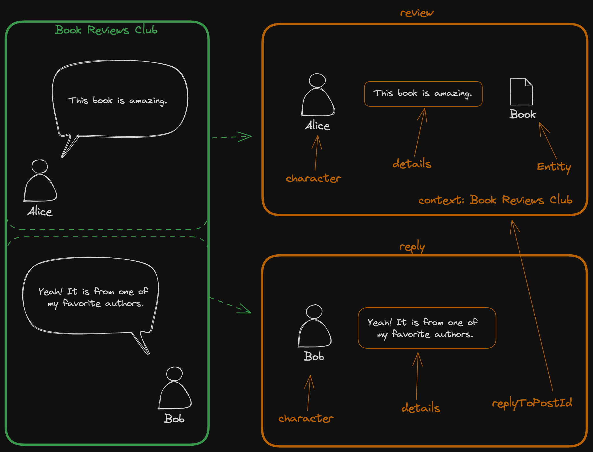
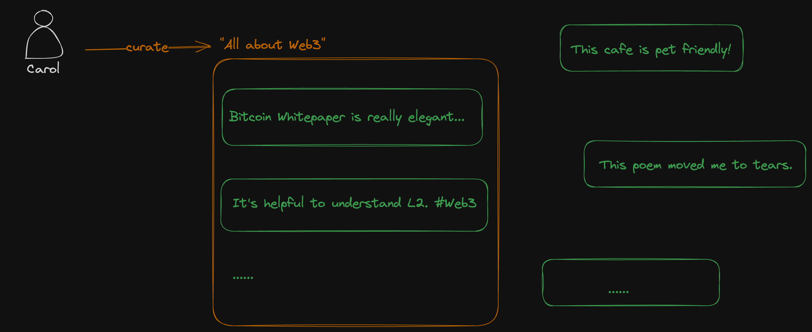

# 简介

## 什么是 Nomland Protocol？

Nomland 是一套关于分享、评论、推荐的协议，规范并聚合了多样的内容，并对分享、评论、推荐整个周期中涉及的价值进行记录。

## 为什么需要 Nomland？

对于还没有被统一或记录的分享场景，Nomland 可以在统一这些场景并在其上建立全新的应用（社区图书馆就是第一个这样的应用）；对于已经被记录的分享（如大众点评/yelp/豆瓣）场景，Nomland 将为其提供价值分配的引擎帮助其变得更好。

## 总览

Nomland 规范了日常生活中分享评论推荐的场景。如图所示，一个可能发生的场景是在一个叫做“Book Reviews Club”的社区里 Alice 首先发起了对一本书的推荐及讨论，随后 Bob 等人加入到讨论中来。

对于这种情景，根据 Nomland 协议，首先可以解析出一条 review，然后将 Bob 的消息解析为一条 reply。对于一条 review，Nomland 规定了 character，details，entity 和 context 四个元素。对于每个 reply，Nomland 规定了 character，details 和 replyToPostId。（具体的定义可以参考 Concepts 章节）

Character 是 Nomland 协议中的参与者，不管是回复还是评论，都是 Character。

Context 是 Nomland 特别引入的概念，也是 Nomland 协议和其他协议最大的区别。Context 暗示了在实际的分享场景中，一个分享本身的价值同时也可能高度依赖于它所处的 context。在实际应用时，可以根据实际情况区分不同的 context，如一个线上社区是一个 context，一个 dApp 也对应一个 context。

除了基础的分享、评论和推荐的场景，Nomland 也支持后续基于已有的 review 进行 curate。

如 Carol 选取了一些和 Web3 有关的 Review，然后建立了一个 “All about Web3” 的 Curation。

## 快速开始

以下的是一个通过 Nomland 协议构建一个点评餐厅的应用的案例。
[TBD]