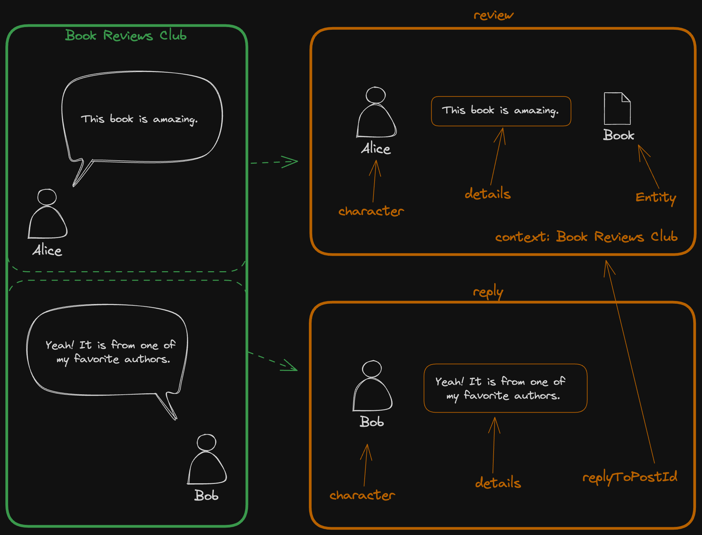

# 构建你的第一个 Nomland 应用
<i>👷 本篇文档还在完善中</i>


让我们通过 Nomland 协议来构建一个文章推荐的应用。 

## 创建内容



如图所示，假设一个场景是在一个叫做“Book Reviews Club”的社区里 Alice 首先发起了对一本书的推荐及讨论，随后 Bob 等人加入到讨论中来。

对于这种情景，根据 Nomland 协议，首先可以解析出一条 review，然后将 Bob 的消息解析为一条 reply。

```TODO:code here```


## 策展内容

在积累了一定数量的分享、评论和推荐的场景之外，也许还会有整理信息二次推荐分发的需求。


如 Carol 选取了一些和 Web3 有关的 Review，然后建立了一个 “All about Web3” 的 Curation。

这种需求可以通过 Nomland 的 review 功能进行 curate。

```TODO:code here```
